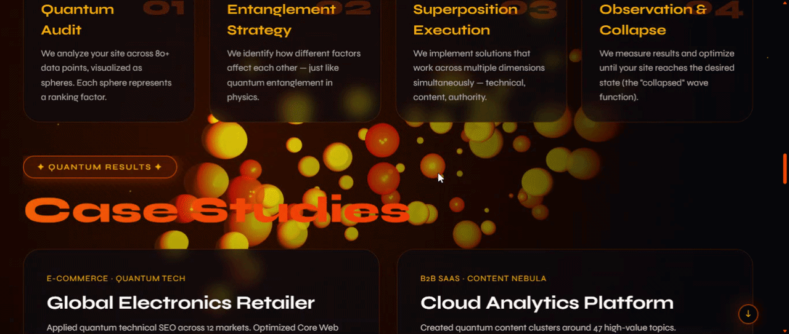

# QUANTUM SEO - Interactive 3D Portfolio

<div align="center">
  
  
  <br>
  <br>
  
  [](https://ghostlayer168.github.io/quantum-seo-portfolio/)
  
  <br>
  
  
  
  
  
</div>

## ⚡ Experience the Quantum Realm

An interactive portfolio website featuring **80 dynamic spheres** that respond to mouse movement in real-time. Built with Three.js, this project visualizes SEO concepts through quantum-inspired 3D graphics.

> ⚠️ **IMPORTANT: For the full quantum experience**
> - **Desktop viewing is strongly recommended** - the 3D interaction is optimized for mouse movement
> - Mobile devices will work but the sphere interaction is best experienced with a cursor
> - For the complete effect, use Chrome, Firefox, or Edge on a desktop/laptop

## ✨ Quantum Features

- **80 Interactive Spheres**: Each sphere has unique size, speed, and depth - smaller spheres move faster and react more intensely to your cursor
- **Real-time Physics**: Spheres react to mouse movement with natural repulsion forces and gentle wave-like motions
- **Smart Scroll Button**: Changes direction based on scroll position (↓ when at top, ↑ when near bottom)
- **Custom Quantum Components**: 
  - Glitch text effects with quantum theme
  - Floating particle field
  - Gradient borders with animations
  - Custom select dropdown
- **Fully Responsive**: Adapts to all screen sizes (though desktop is recommended!)

## 🛠️ Technology Stack
├── Frontend Core
│ ├── Three.js r128 - 3D graphics engine
│ ├── Vanilla JavaScript ES6+ - Interactive logic
│ └── HTML5/CSS3 - Structure & styling
│
├── Visual Effects
│ ├── Custom particle system
│ ├── Real-time sphere physics
│ ├── CSS keyframe animations
│ └── Gradient & glitch effects
│
└── Performance
├── Optimized collision detection
├── Debounced resize handlers
└── Mobile-specific optimizations

text

## 🎯 Interactive Elements

### The Spheres
- **Size Range**: 0.3 to 2.5 units
- **Speed**: Inversely proportional to size
- **Colors**: 6 shades from deep orange (#ff3300) to bright yellow (#ffbb00)
- **Behavior**: 
  - Gentle wave motion
  - Mouse repulsion
  - Collision detection
  - Boundary constraints

### Custom Components
```javascript
// Example: Sphere with unique properties
{
  size: 0.3 + Math.random() * 2.2,
  velocity: new THREE.Vector3(x, y, z),
  phase: random phase for wave motion,
  color: quantum orange shades
}
🚀 Quick Start
Option 1: Visit Live Demo
Simply visit our Quantum Portal - no installation required!

Option 2: Run Locally
bash
# Clone the repository
git clone https://github.com/ghostlayer168/quantum-seo-portfolio.git

# Navigate to project
cd quantum-seo-portfolio

# Open in browser (Mac)
open index.html

# OR (Windows)
start index.html

# OR (Linux)
xdg-open index.html
📁 Project Structure
text
quantum-seo-portfolio/
├── 📄 index.html              # Main HTML file
├── 📁 assets/
│   ├── 📁 css/
│   │   └── style.css         # All styles (1300+ lines)
│   └── 📁 js/
│       └── main.js           # Three.js logic (400+ lines)
├── 📄 .gitignore              # Git ignore file
├── 📄 README.md               # This file
└── 📄 preview.gif            # Animated preview (optional)
💻 Desktop vs Mobile Experience
Feature	Desktop	Mobile
Sphere Count	80 spheres	50 spheres
Interaction	Full mouse control	Touch-optimized
Collisions	Enabled	Disabled for performance
Particle Effects	Full	Reduced
Animation Quality	High	Optimized
🔧 Technical Deep Dive
Sphere Physics Algorithm
javascript
// Each sphere has:
- Unique velocity vector
- Wave motion phase
- Size-based speed scaling
- Mouse repulsion force
- Boundary collision response

// Optimization strategies:
- Viewport-based sphere count
- Mobile collision disabling
- Debounced resize handling
Performance Metrics
FPS: 60 on desktop, 30+ on mobile

Sphere count: 80 (desktop) / 50 (mobile)

Collision checks: O(n²) with n ≤ 80

Memory usage: ~50MB

🎨 Design Philosophy
The quantum theme is maintained through:

Colors: Black (#000000) with orange gradients (#ff3300 → #ffaa00)

Typography: Syne font for futuristic feel

Terminology: "Dimensions", "Portal", "Quantum", "Nebula"

Animations: Glitch effects, particle float, quantum pulse

🌐 Browser Support
Browser	Version	Support
Chrome	90+	✅ Full
Firefox	88+	✅ Full
Safari	14+	✅ Full
Edge	90+	✅ Full
Opera	76+	✅ Full
Mobile Safari	14+	✅ Optimized
Chrome Android	90+	✅ Optimized
👩‍🎨 About the Creator
Created by Oleksandra Zdoronok - a creative developer passionate about interactive 3D experiences and quantum-inspired design.

<div align="center"> <br> <a href="https://github.com/ghostlayer168">  </a> <a href="https://linkedin.com/in/yourusername">  </a> <a href="https://yourportfolio.com">  </a> <br> <br> </div>
📄 License
MIT License - feel free to use for your own portfolio!

license
Copyright (c) 2026 Oleksandra Zdoronok

Permission is granted to use, copy, modify, merge, publish, distribute, 
sublicense, and/or sell copies of the Software, subject to the following 
conditions: The above copyright notice and this permission notice shall 
be included in all copies or substantial portions of the Software.
<div align="center"> <br> <strong>⚡ Created with quantum energy for the digital age ⚡</strong> <br> <br> <sub>✨ 80 spheres • 7 dimensions • infinite possibilities ✨</sub> <br> <br> <a href="https://ghostlayer168.github.io/quantum-seo-portfolio/">  </a> </div> ```